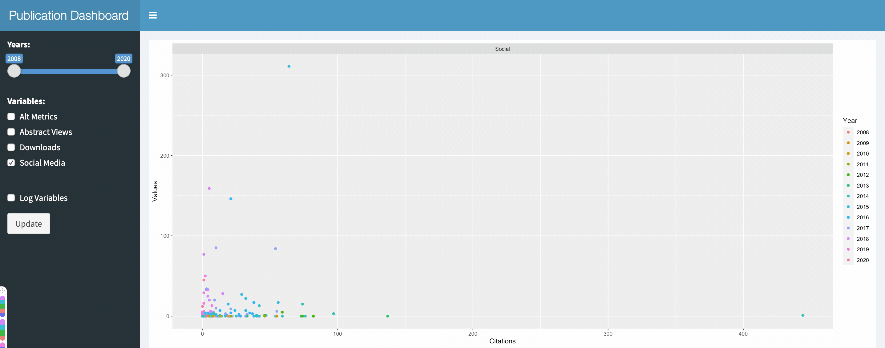
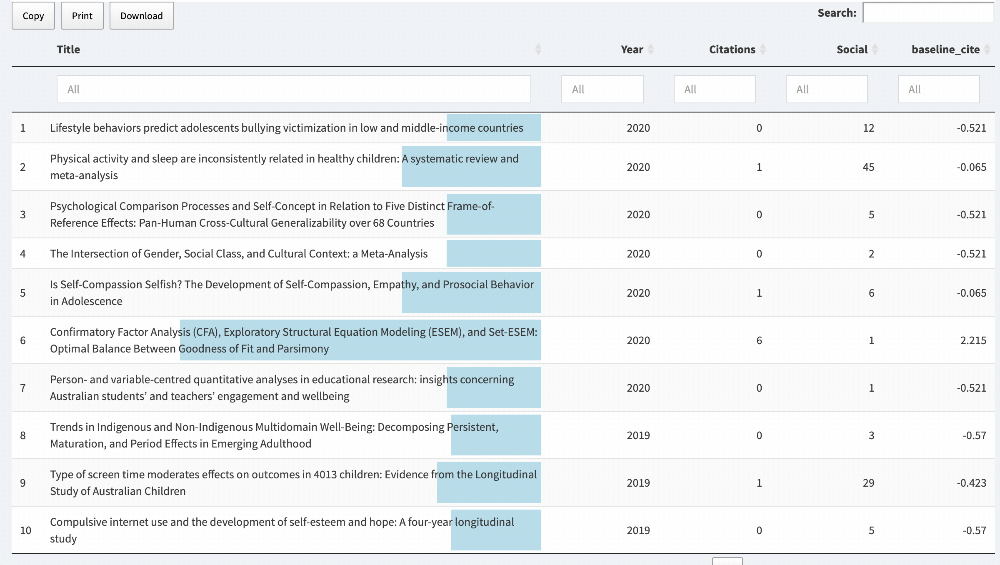
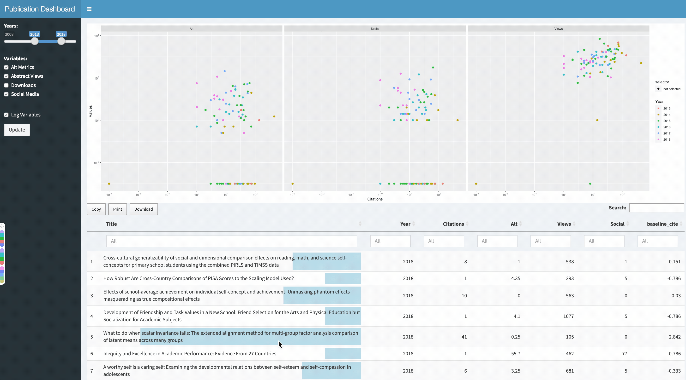

# Citation Tracking Dashboard
Using Scopus API to monitor citations. 
Also accesses Plum X metrics and ALT metrics

# Reactive 
Update insights based on filters and selectors.

# Citation Insight
Year normalized citations provide insight into what papers are hot and 
what papers are not. Graphical indicators (blue) underlying titles give easy insight. Copy print and download results.

# Connect Insight
Connect insight from tables to plots

